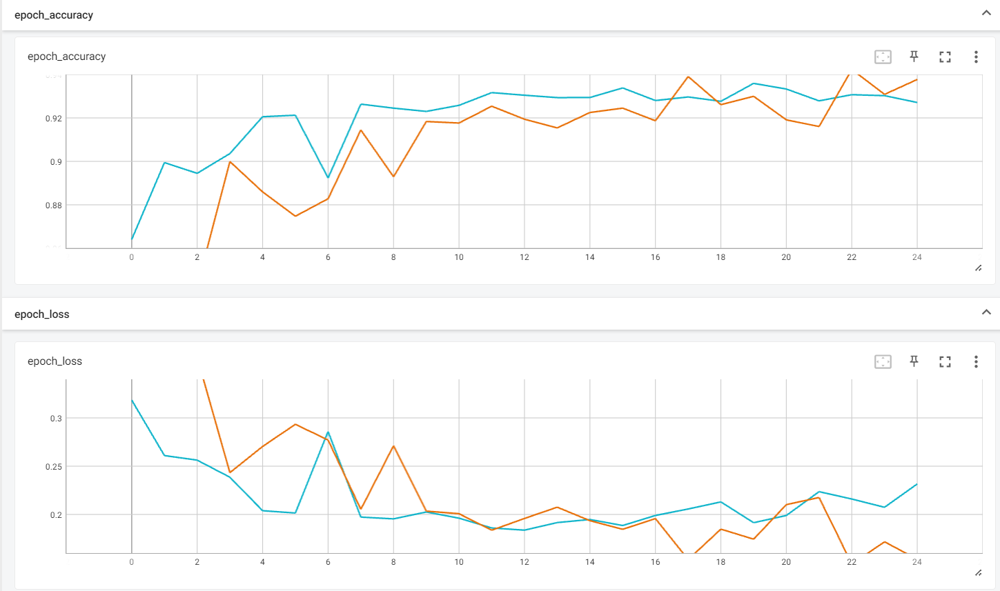

# **Stable Diffusion Image Classification Using PatchGAN and CNN**

## **Introduction**

This project attempts to tackle the increasingly relevant problem of classifying real images from those generated through sophisticated techniques like stable diffusion. This repository contains two machine learning models that are designed for this problem:
- **PatchGAN Discriminator:** Inspired by the discriminator in a pix2pix generative adversarial network [[1]](https://www.tensorflow.org/tutorials/generative/pix2pix), the PatchGAN discriminator was designed to evaluate whether an image is real or fake by determining whether individual patches of the image are real or fake. This feature will hopefully allow it to learn the finer details of the images and better distinguish real images from those generated through stable diffusion.
- **Convolutional Neural Network:** A simple CNN was used as a baseline for comparison against the PatchGAN model. This model was inspired by Sahil Danayak on Kaggle [[2]](https://www.kaggle.com/code/sahildanayak/real-and-ai-images-classifier).

This project uses real images from the CIFAR-10 dataset [[3]](https://www.cs.toronto.edu/~kriz/learning-features-2009-TR.pdf), and stable diffusion images from the CIFAKE dataset created by Bird & Lofti [[4]](https://arxiv.org/abs/2303.14126).

## **Convolutional Neural Networks (CNNs)**
### **Convolutional Layers**
The convolutional layer is well-suited to process spatial data. In this layer, a number of "filters" slide across the image, attempting to learn features that commonly appear and match them to segments of the image. During a forward pass when an image is input into the convolutional layer, each filter is slid around the image, creating a feature map. This feature map makes predictions about which features are present in which segments of the image, with each subsequent layer investigating larger segments of the image by applying filters to the feature map from the last layer. After the forward pass, a loss function is applied, quantifying how well the network represented the image through its feature map. During the backward pass, the gradient of this loss function is applied to the parameters, and the filters are adjusted to minimize the loss.
### **Activation Layers**
The activation layers introduce non-linearity into the system, such that the model can learn to approximate a solution. In the baseline CNN, we use sigmoid activation in the final layer, outputting a number between 0 and 1 representing the model's confidence that the image is real (a higher value represents more confidence in the realness of the image, a lower value represents less).
### **Pooling Layer**
The MaxPooling layer used in the baseline CNN selects the most prominent features from the feature map for each "window" of the image, a window just being a segment of the image defined by its height and width. MaxPooling serves to downsample the feature map to reduce the number of model parameters, increase computational efficiency, and allow the network to learn features more effectively.
### **Dropout Layer**
During training, the dropout layers randomly select a proportion of the input units to 0, essentially removing those neurons from consideration. Doing so reduces overfitting by forcing the network to rely on more of the neurons in the network, instead of very few of them becoming overly specialized.
### **Dense Layer**
A dense layer is used at the end of the CNN to perform classification based on the features extracted by the convolutional layers.

## **PatchGAN Discriminator**
The PatchGAN architecture is a specialized CNN designed to classify each patch of an image as real or fake. It is typically used in pix2pix image translation, where it is used to discern real samples from generated ones in a generative adversarial network. Instead of just extracting the features of the image, the PatchGAN architecture assigns a prediction of realness to each patch of the input image, and makes a determination based on its patch-wise predictions rather than the feature map.
### **Downsampling Layers**
Each image input into the PatchGAN is downsampled to reduce its dimensions and extract features. The downsampling layers first apply a convolutional layer, then batch normalization to standardize the feature maps. LeakyReLU activation is then used to introduce non-linearity, and we added a dropout layer to each downsampling such that the model does not overfit.
### **Convolutional and Padding Layers**
After downsampling, the feature maps produced are passed into a large convolutional layer to learn more about the image and its features. The padding layers preserve the dimensions of the feature map, which ensures that the network retains contextual information for each patch of the image.
### **Dense Layer**
One dense layer is used at the end of our PatchGAN, learning from the abstraction of the features to make a prediction about the authenticity of the image. Like the CNN, we use a sigmoid activation function. In the PatchGAN, the output of this layer is the "patch-wise classification score," because the model makes use of information and context inferred from the patches to make predictions about them, using them towards an overall prediction about the image.

## **Example Images**

<table>
  <tr>
    <td>
        
Real Images
 
         
         
         
         
         
    </td>
    <td>
        
Fake Images
 
         
         
         
         
         
    </td>
  </tr>
</table>

## **Results**
Both models were trained for 25 epochs with no GPU/TPU acceleration. The CNN took 1.6 hours to train, while the PatchGAN took 4.2 hours.

### **Training Metrics**

These graphs chart the accuracy and loss after each training step. The dark blue line represents the CNN, and the green line represents the PatchGAN. The CNN outperformed the PatchGAN in training, with metrics after 25 epochs shown in the table below:

| Model Name             | Loss     | Accuracy | Precision | Recall |
|------------------------|----------|----------|-----------|--------|
| PatchGAN Discriminator | 0.1492   | 0.9412   | 0.9416    | 0.9408 |
| Simple CNN             | 0.1200   | 0.9552   | 0.9486    | 0.9626 |

### **Validation Metrics**

These graphs chart the accuracy and loss of the models on the validation sets after each epoch. The light blue line represents the CNN, and the orange line represents the PatchGAN. While the CNN outperformed the PatchGAN in earlier epochs, the PatchGAN improved more slowly but persistently and surpassed the CNN in accuracy and loss in later epochs. The metrics of each model on the validation set after 25 epochs are displayed below:

| Model Name             | Loss     | Accuracy | Precision | Recall |
|------------------------|----------|----------|-----------|--------|
| PatchGAN Discriminator | 0.1536   | 0.9377   | 0.9143    | 0.9671 |
| Simple CNN             | 0.2316   | 0.9271   | 0.9493    | 0.9024 |

## **Limitations**
Although the PatchGAN discriminator eventually managed higher validation accuracy, the training time was significantly longer. Additionally, the PatchGAN model required more fine-tuning on downsampling, dropout, and the number of filters to prevent overfitting. A more overarching limitation of this problem is that, while we successfully trained models to quite accurately discern real and generated images on this dataset, sophisticated techniques to create more convincing generated images are constantly evolving, and these models might not be applicable to those techniques unless also trained on a dataset that contains images generated with these techniques.

## **Requirements**
- Python 3.x
- Tensorflow 2.x
- NumPy

## **Installation**
<pre>
git clone https://github.com/nabraun03/stable-diffusion-image-classification.git
cd stable-diffusion-image-classification
pip install -r requirements.txt
</pre>
**Note:** This repository does not contain the dataset used. The CIFAKE dataset can be downloaded from Kaggle [here](https://www.kaggle.com/datasets/birdy654/cifake-real-and-ai-generated-synthetic-images)

## **Usage** 
To run the project after cloning the repository and downloading the dataset, execute the following command:
<pre>
  python main.py
</pre>

## **Citations and Licensing**
[[1]](https://www.tensorflow.org/tutorials/generative/pix2pix) Copyright 2019 The Tensorflow Authors
<pre>
Licensed under the Apache License, Version 2.0 (the "License");

You may not use this file except in compliance with the License.

You may obtain a copy of the License at

  http://www.apache.org/licenses/LICENSE-2.0

Unless required by applicable law or agreed to in writing, softwaredistributed under the License is distributed on an "AS IS" BASIS,WITHOUT WARRANTIES OR CONDITIONS OF ANY KIND, either express or implied. See the License for the specific language governing permissions and limitations under the License.
</pre>
[[2]](https://www.kaggle.com/code/sahildanayak/real-and-ai-images-classifier) Copyright 2023 Sahil Danayak
<pre>
Licensed under the Apache License, Version 2.0 (the "License");

You may not use this file except in compliance with the License.

You may obtain a copy of the License at

  http://www.apache.org/licenses/LICENSE-2.0

Unless required by applicable law or agreed to in writing, software distributed under the License is distributed on an "AS IS" BASIS, WITHOUT WARRANTIES OR CONDITIONS OF ANY KIND, either express or implied. See the License for the specific language governing permissions and limitations under the License.
</pre>
[[3]](https://www.cs.toronto.edu/~kriz/learning-features-2009-TR.pdf) Krizhevsky, A., & Hinton, G. (2009). Learning multiple layers of features from tiny images.

[[4]](https://arxiv.org/abs/2303.14126) Bird, J.J., Lotfi, A. (2023). CIFAKE: Image Classification and Explainable Identification of AI-Generated Synthetic Images. arXiv preprint arXiv:2303.14126.
<pre>
License: Permission is hereby granted, free of charge, to any person obtaining a copy of this software and associated documentation files (the "Software"), to deal in the Software without restriction, including without limitation the rights to use, copy, modify, merge, publish, distribute, sublicense, and/or sell copies of the Software, and to permit persons to whom the Software is furnished to do so, subject to the following conditions:

The above copyright notice and this permission notice shall be included in all copies or substantial portions of the Software.

THE SOFTWARE IS PROVIDED "AS IS", WITHOUT WARRANTY OF ANY KIND, EXPRESS OR IMPLIED, INCLUDING BUT NOT LIMITED TO THE WARRANTIES OF MERCHANTABILITY, FITNESS FOR A PARTICULAR PURPOSE AND NONINFRINGEMENT. IN NO EVENT SHALL THE AUTHORS OR COPYRIGHT HOLDERS BE LIABLE FOR ANY CLAIM, DAMAGES OR OTHER LIABILITY, WHETHER IN AN ACTION OF CONTRACT, TORT OR OTHERWISE, ARISING FROM, OUT OF OR IN CONNECTION WITH THE SOFTWARE OR THE USE OR OTHER DEALINGS IN THE SOFTWARE.
</pre>
